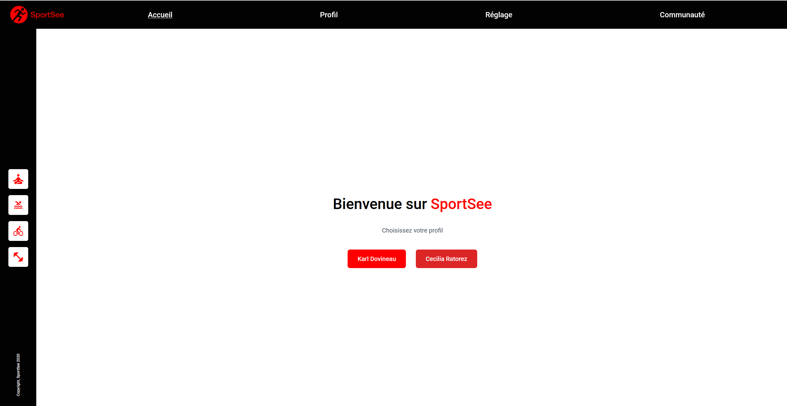
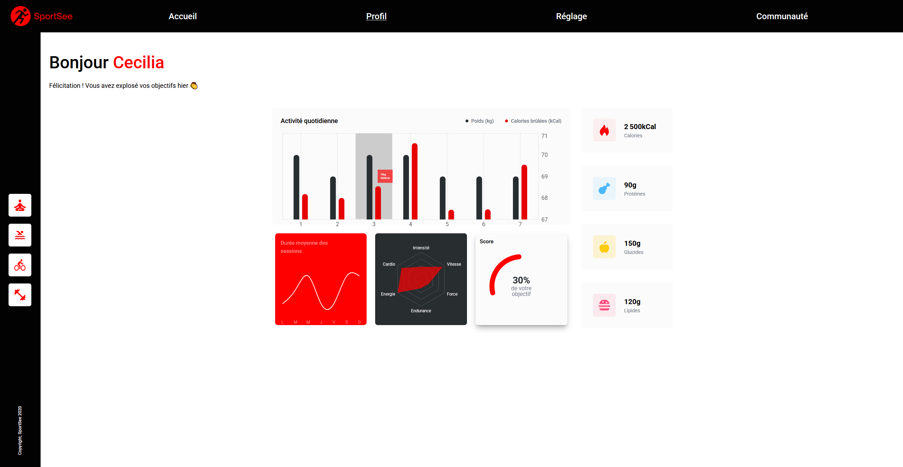
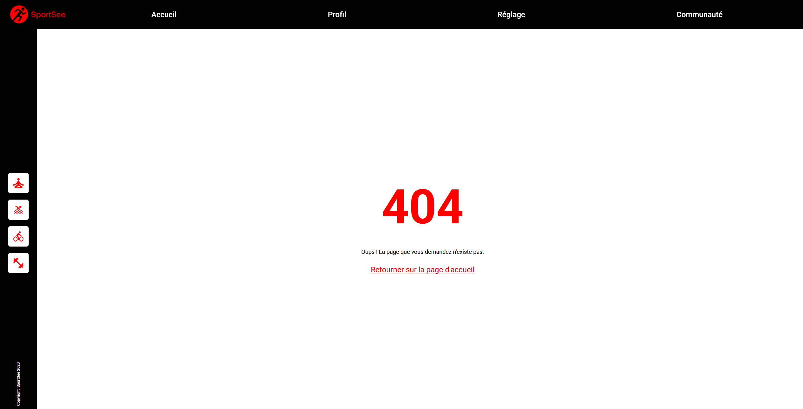

# 🏃 SportSee - Tableau de bord d'analytics sportif


> Projet 12 - Formation Développeur d'application JavaScript React - OpenClassrooms


SportSee est une application React qui affiche les données sportives d'un utilisateur via des graphiques interactifs. 
Le projet met l'accent sur la visualisation de données avec Recharts et l'intégration d'une API REST.


## 📋 Table des matières

- [Aperçu](#aperçu)
- [Fonctionnalités](#fonctionnalités)
- [Technologies utilisées](#technologies-utilisées)
- [Prérequis](#prérequis)
- [Installation](#installation)
- [Lancement du projet](#lancement-du-projet)
- [Structure du projet](#structure-du-projet)
- [API Backend](#api-backend)
- [Graphiques implémentés](#graphiques-implémentés)
- [Documentation](#documentation)


---
# Aperçu

### Page d'accueil


### Dashboard utilisateur


### Page 404


---

## Fonctionnalités

- Affichage du profil utilisateur avec message de bienvenue personnalisé
- Visualisation de l'activité quotidienne (poids et calories)
- Graphique des sessions moyennes par jour de la semaine
- Radar chart des performances par type d'activité
- Score de complétion de l'objectif journalier
- Cartes d'informations clés (calories, protéines, glucides, lipides)
- Gestion des états de chargement et d'erreur
- Composants réutilisables et modulaires
- Navigation entre utilisateurs via l'URL

---

## Technologies utilisées

### Frontend
- **React 18.3.1** - Interface utilisateur
- **Vite 6.0.3** - Build tool / Dev server
- **Recharts 2.15.0** - Graphiques pour React
- **React Router 7.1.1** - Navigation
- **Tailwind CSS 3.4.17** - CSS utility-first
- **PropTypes 15.8.1** - Validation des props

### Outils de développement
- **ESLint**
- **PostCSS**
- **Autoprefixer**

---

## Prérequis

- **Node.js** (version 12.18 ou supérieure) - [Télécharger Node.js](https://nodejs.org/)
- **npm** ou **yarn** - Gestionnaire de paquets
- **Git** - Pour cloner le repository

---

## Installation

### 1. Cloner le repository

```bash
git clone https://github.com/MTDev2024/SportSeeApp.git
cd SportSeeApp
```

### 2. Installer les dépendances

```bash
npm install
```

ou avec Yarn :

```bash
yarn install
```

---

## Lancement du projet

### Mode développement

```bash
npm run dev
```

L'application sera accessible sur **http://localhost:5173**

### Build de production

```bash
npm run build
```

Les fichiers optimisés seront générés dans le dossier `dist/`

### Prévisualiser le build

```bash
npm run preview
```

---

## Structure du projet

```
SportSee/
├── public/               # Fichiers publics statiques
├── src/
│   ├── assets/           # Images et icônes
│   ├── components/       # Composants réutilisables
│   │   ├── Layout/       # Header, Sidebar, Layout
│   │   ├── Charts/       # Graphiques Recharts
│   │   └── UI/           # KeyDataCard, Greeting
│   ├── data/             # Données mockées
│   ├── pages/            # Pages (Home, Profil, Error)
│   ├── services/         # Appels API
│   ├── utils/            # Fonctions utilitaires
│   ├── App.jsx           # Composant racine avec routes
│   ├── main.jsx          # Point d'entrée de l'application
│   └── index.css         # Styles globaux Tailwind
├── .eslintrc.cjs         # Configuration ESLint
├── tailwind.config.js    # Configuration Tailwind CSS
├── vite.config.js        # Configuration Vite
└── package.json          # Dépendances et scripts
```

---

## API Backend

Le projet utilise un backend Node.js fourni par OpenClassrooms.

### Repository backend
- **GitHub :** [SportSee Backend](https://github.com/OpenClassrooms-Student-Center/SportSee)

### Endpoints disponibles

| Endpoint | Description |
|----------|-------------|
| `GET /user/:id` | Récupère les informations principales de l'utilisateur |
| `GET /user/:id/activity` | Récupère l'activité quotidienne (poids, calories) |
| `GET /user/:id/average-sessions` | Récupère la durée moyenne des sessions par jour |
| `GET /user/:id/performance` | Récupère les performances par type d'activité |

### Utilisateurs disponibles
- **User ID 12** - Karl Dovineau
- **User ID 18** - Cecilia Ratorez

### Lancer le backend

```bash
# Cloner le repo backend
git clone https://github.com/OpenClassrooms-Student-Center/SportSee.git
cd SportSee

# Installer les dépendances
yarn install

# Lancer le serveur
yarn dev
```

Le backend sera accessible sur **http://localhost:3000**

---

## Graphiques implémentés

### 1. BarChart - Activité quotidienne
- **Données :** Poids (kg) et Calories brûlées (kCal)
- **Axes :** Dual Y-axis (gauche: kg, droite: kCal)
- **Interaction :** Tooltip personnalisé au survol

### 2. LineChart - Durée moyenne des sessions
- **Données :** Durée des sessions par jour de la semaine
- **Style :** Courbe lisse avec dégradé
- **Interaction :** Tooltip et effet d'overlay au survol

### 3. RadarChart - Performance
- **Données :** 6 types de performance (Cardio, Énergie, Endurance, Force, Vitesse, Intensité)
- **Style :** Radar hexagonal avec labels personnalisés

### 4. RadialBarChart - Score
- **Données :** Pourcentage de complétion de l'objectif
- **Style :** Graphique circulaire avec pourcentage central

---

## 📝 Documentation

### PropTypes
Tous les composants utilisent **PropTypes** pour la validation des props :

```jsx
ComponentName.propTypes = {
  propName: PropTypes.string.isRequired,
};
```

### JSDoc
Les fonctions importantes sont documentées avec **JSDoc** :

```jsx
/**
 * Récupère les données principales de l'utilisateur
 * @param {number} userId - ID de l'utilisateur
 * @returns {Promise<Object>} Données utilisateur
 */
export async function getUserData(userId) { ... }
```

---

## Choix techniques

### Recharts 
- Intégration native avec React (composants)
- API déclarative
- Personnalisation
- Courbe d'apprentissage

### Gestion des données
- **Mocks** : Données mockées pour le développement initial
- **API** : Intégration de l'API backend fournie
- **Standardisation** : Normalisation des données API avant utilisation

### Architecture des composants
- **Séparation des responsabilités** : UI / Logique / Services
- **Composants réutilisables** : KeyDataCard, graphiques modulaires
- **Props explicites** : Clarté du code et maintenance facilitée

---

## Gestion des erreurs

L'application gère les cas suivants :
- Utilisateur introuvable (ID invalide)
- Erreur de connexion à l'API
- Données manquantes ou incohérentes

---

## Améliorations possibles

- Version responsive (tablette, mobile)
- Mode sombre / clair
- Filtres par date
- Comparaison entre utilisateurs
- Export des données en PDF
- Animations sur les graphiques

---

## Auteur

[GitHub](https://github.com/MTDev2024)
Réalisé dans le cadre de ma formation - Développeur d'application JavaScript React.

---


**⭐ Si ce projet vous a été utile, n'hésitez pas à lui donner une étoile sur GitHub !**